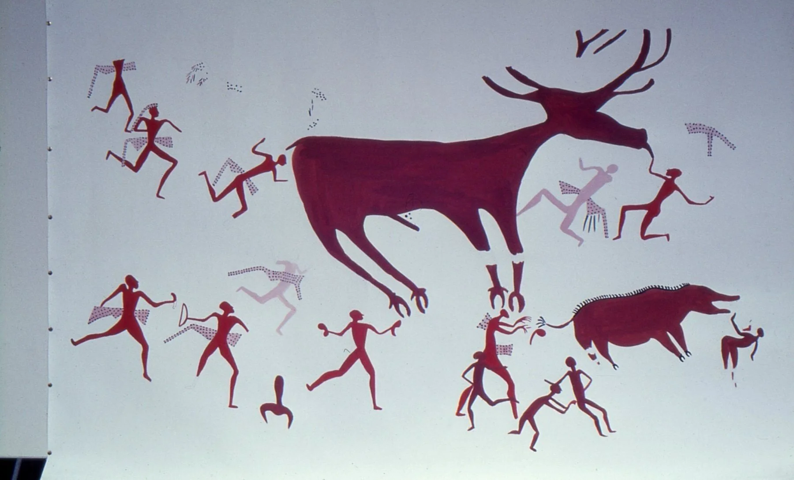
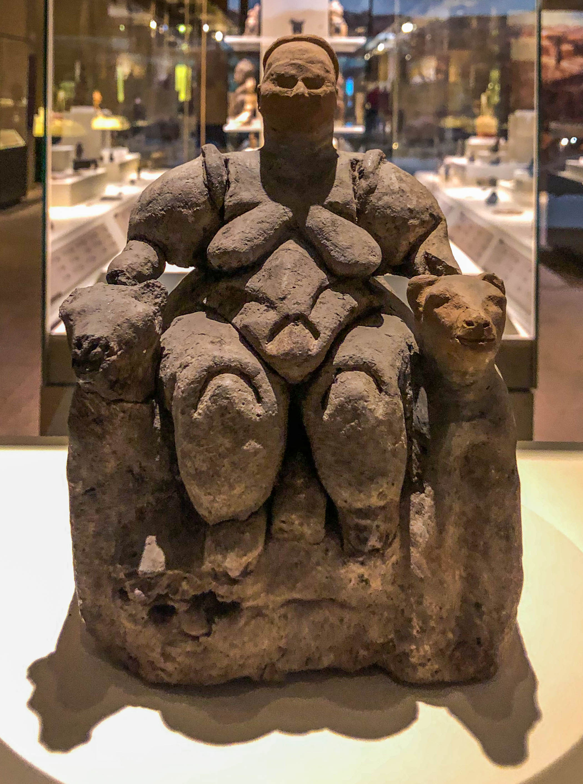
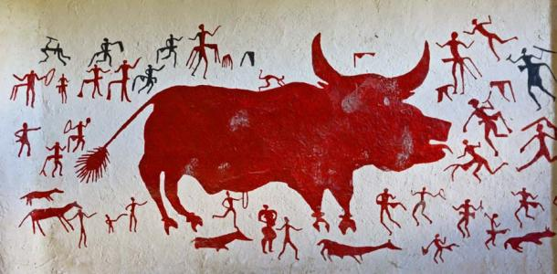

# [Civilization #1: Explaining Humanity's Transition to Agriculture](https://www.youtube.com/watch?v=Jjqf9T59uY0)

Traditional interpretation: hunters and gatherers, then farming and domestication took place. And now more food then needed is created. Now people can do more than food searching. So now we have leaders, priests, arts.

There is evidence that this is not true.

It was actually counter productive to transition to farming.

## Reasons

1. If you're hunter-gatherer there is food everywhere and you don't need to work a lot, where the farmar needs to work 10+ hours a day. Now you need to have more children to have more labor. Overpopulation, using too much land and it becomes dead.

2. Hunter-gatherers are a lot taller than farmers. Meat, milk, nuts, fruits, very nutricious diet. Farmer eats only what grows.

3. Farmer is much likely to die earlier. Because of wild animals, garbage, excrements.

---

So this transition makes no sense.

Instruments to study civilization:

1. Archeology.
2. Anthropology.
3. Psychology.
4. Primatology.

## Theories

1. Coercion. Elites didn't want to work and made others to. Gorillas have an alpha which does nothing and has all the females and food. However for humans it's different because cooperative humans can make weapons and traps and trick the alpha.

2. War. On a farm it's easier to protect yourself. Build walls, see them coming, etc. Chimpanzees go to war a lot. However chimpanzees do not fight each other. And the weapons of early humans are not found.

3. Respect for elders. Hunter-gatherers are hard for old people. So not to leave them stay and die, every culture respects elders.

4. We settle down to practice religion. Most scholars agree on this.

### Gobekli Tepe

The oldest place in history. T-shapes represent humans, within T-shapes are animals. Designed to practice rituals.

Shamans were conducting rituals. Charismatic leaders. Everyone has need for relegion but not everyone can produce religion. So there are people who have visions/revelations of God and the spirit world and can present them to people.

Images on the walls of the temple are animals in the motion of attack. If you need to kill the animals you need to ask for their forgiveness of their spirit will haunt you. That's why the images are there as a tribute to them. Also you channel their energy and power. Another reason is to befriend them.

### Jericho

Sedentary hunter-gatherers. The people hunted gazelles in winter which means they didn't move. Also growed some seeds. Had capacity to farm but chose not to.

Cult of the skull. Worship of ancestors. Dead are in the spirit world. Keeping their skull allows for communication with that world and get information.

Tower of Jericho. The village was covered in shadow when the sun was up, that makes the village connect with the sky, "heaven", because the night sky is dark. They collapsed the space between earth and sky.

### Çatalhöyük

3000 BC. Giant town. Didn't have a place of worship or government. All houses are the same, egalitarian society. Each house had a temple room. First religious community meaning religion was a part of everyday life all the time.

Vulture is a representation of mother-goddess, because bird flies in the sky above everything. The headless people are dead ancestors. So when people died they placed the corpse in the wilderness, sky burial, the vultures eat them. Take the bones back as a religious item for worship.

Hunters are dancing to the animals they are about to kill. Showing respect and friendship so that the spirit doesn't avenge them.

Mother-goddess is nature, female principle, bull is energy, male principle. Again, people here are worshipping the bull.

## Conclusion

There were charismatic leaders with which people settled to practice religion. Over time they transitioned to agriculture while already being sedentary.
