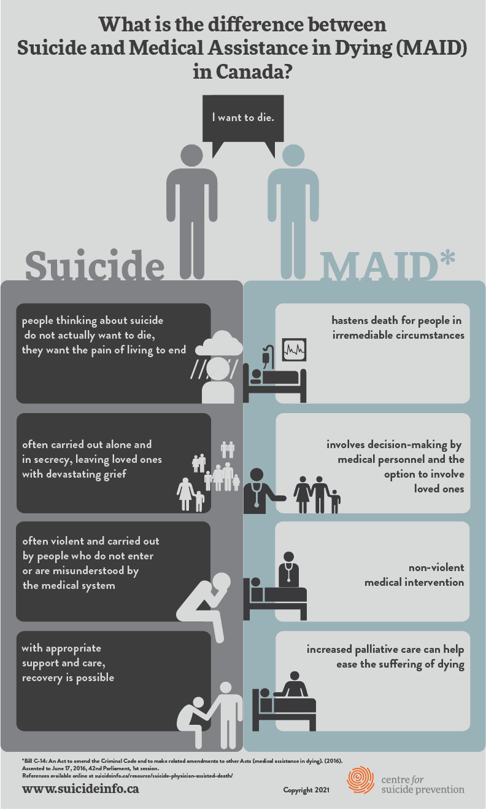
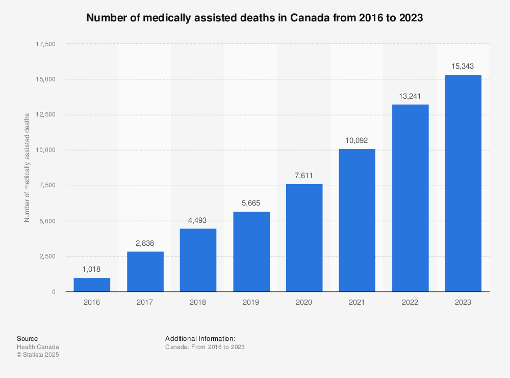
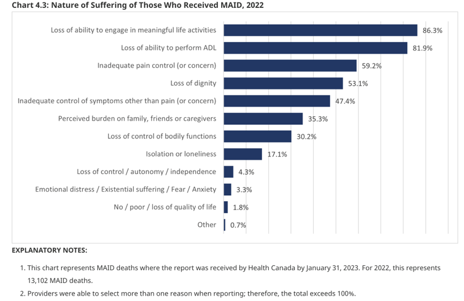
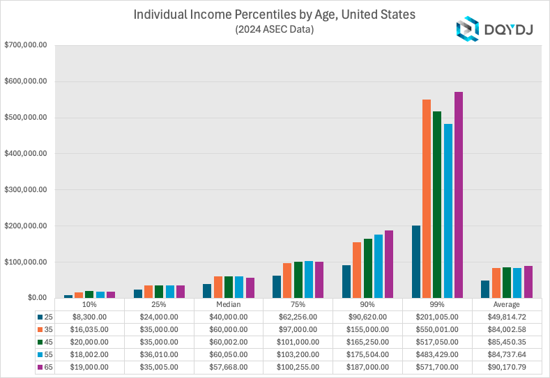

# [Secret History #3: Death by Gerontocracy](https://www.youtube.com/watch?v=0g3yo1DjiLM)

Overflowing immigration in western world. 1/3 of Australian population is immigrants. 1/4 of Canadian. Up to 1/5 in Britain, France, Germany.

Points:

1. If you suicide you do it alone and shock your family and friends. But if you do government-assisted suicide everyone knows and will not be as sad.
2. You can mess up, but the government will do it properly.

Government-assisted suicide is approved in 10 days. Approved outcomes go up almost as if there's a quota that needs to be fulfilled.

Most of the killed by the government had cancer. The thing about it is that most of it is not terminal, you can still live. Also cancer is the most expensive to treat. So cancer patients are encouraged to die because they are a burden on the system.

The biggest reason is abscence of happiness. Second biggest is literally "It's hard to buy groceries, to walk around".

So poor people get killed because they are a burden on the medical system.

Before it was held as truth that every life is given by God and we have to protect it especially the poor and vulnerable because that's how society comes together. If you let anyone die, how would you know that you will be protected?

Now what matters is money.

Stock market is booming, financialization of society without increase of real economy, fake world basically. The government gaslights that everything is good.

US government is in debt of 37 trillion, the people in 17 trillion. They are finished.

No children.

Nation's assets are owned by foreigners.

## Trends

* High property prices
* Inflation and low quality of life
* No real economic growth
* Killing the poor
* Immigration replacement
* No births
* Debt
* Government gaslighting
* Privatization / asset stripping

## Theories

1. Neo-liberalism. All that matters is economic growth.
2. Techno-feudalism. Tech companies want to control the world and put everyone into slaves. If you don't have a house, land and / or vehicle you are in their control.
3. World Government. Transnational companies and organizations want to destroy national sovereignties and unify the world under one government.
4. Population replacement. White people are opinionated and believe in freedom. Harder to control so let's replace them.
5. Bureaucratic Incompetence.

## Game theory analysis

Rich pensioners benefit the most.

These are people who own the real estate and stock market. Killing the poor allows them a better access to healthcare. Immigrants give them cheap labor.

So the listed trends affect them positively or not at all.

Now we have the most old people in a century. Also, the wealth between rich is distributed evenly, so young and old rich people have money. But a lot more rich people are old now.

The problem is the pension system. More accurately that the old people are not dying. So the liabilities are piling up. Also because of the financialization of the economy smart people are making money off the stupid ones. And in the financing world the "stupidest" work in pension funds. So pension funds are constantly ripped off by the investment banks.

There are now more pensioners than workers.

|Young|Mature|Elderly|
|-----|------|-------|
|Rebellious|Conservative|Reactionary|
|Creative|Growth|Safety|
|Open|Consensus|Stubborn|

## Results

Police state. No individual freedom. Intrusive government interference into personal life.

In Canada you can not discipline children physically. But you can report your child to the police and they will come and help you discipline them.

Digital currency, eliminate cash because cash is freedom.

Prisons. Elderly are afraid, also free labour.

Nothing can be done because young people are used to respect elders.
